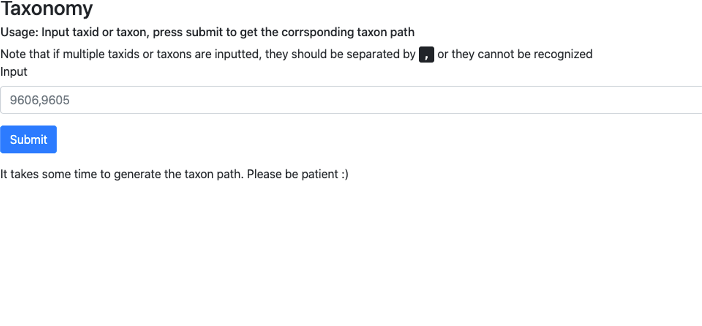
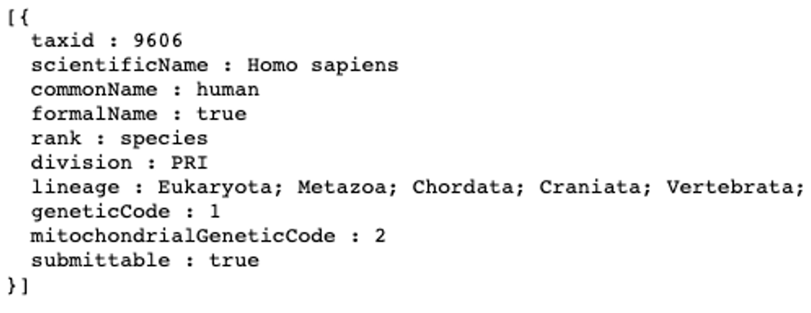

### Introduction
The aim of this software is to allow the user inputs a taxon or taxid and gets the taxon path back.It provides a web page to allow user to input and submit. The output will print out the result in the web.

Taxonomy is the science of naming, which describes and classifies organisms and includes all plants, animals and microorganisms of the world. The parsed database in this application always uses the latest taxonomy database provided by NCBI (https://ftp.ncbi.nlm.nih.gov/pub/taxonomy). 

### Required packages installation
Make sure python is installed and at least in version 3.0
```
# Install Flask if the local does not have it
pip install -U Flask
```

### Usage
```
python tax_sofrware.py
```

Note that whe the user first use it, it takes a while to download the NCBI database and pare data from them to generate new database for the usage of searching corresponding taxon id and generating database. <br>
To save time when first time using this application, before running the above command, it is highly recommended to prepare the databse beforehand. It is done by:
```
python db_preparation.py
```

To avoid the case that the reading of Oracle database may fail in python script, it is also recommended to copy the codes from db_preparation python script in bash python to run the codes of it. It is done by:
```
python
# which will make the bash be able to run pytho code after >>>
# Paste the script into it
# exit() to exit python language reading 
```

After run ___tax_sofrware.py___, a url will be generated on bash.<br>
Copy the given url to the browser<br>
Then the instruction page will show.<br>

<br>
Type in the taxid/taxon that is/are looking forward to finding taxon path and click Submit button.<br>
It may take some time to do the path generation.<br>
The taxon path will be printed out like this:


